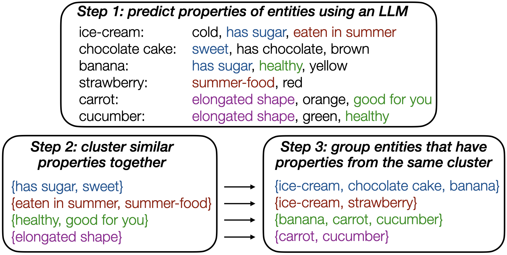

# Grouping Entities with Shared Properties using Multi-Facet Prompting and Property Embeddings

This repository contains the code and resources accompanying the paper:

**"Grouping Entities with Shared Properties using Multi-Facet Prompting and Property Embeddings"** [Read the paper (PDF)](./3527_Grouping_Entities_with_Sh.pdf)

---

## Abstract
We study **commonality identification**: given a set of entities, find meaningful ways to group them by shared properties.  
Our approach leverages **large language models** to generate diverse facet-property descriptions for each entity, encodes them with **LLM2Vec embeddings**, and clusters them into categories.  
This simple strategy outperforms strong baselines on **ontology completion** and **ultra-fine entity typing** tasks.

---

## Methodology

<p align="center">
  
</p>

1. **Prompting**: `Meta-Llama-3-8B-Instruct` generates facet–property pairs.  
2. **Encoding**: properties are embedded using `LLM2Vec-Mistral-7B-Instruct-v2-mntp`.  
3. **Clustering**: affinity propagation groups entities with shared property embeddings.  

---

## Usage

### Setup
```bash
git clone https://github.com/thomas-bllx/grouping-entities-mfp.git
cd <repo-name>
pip install -r requirements.txt
````

### Run the pipeline

1. **Prompt the LLM**

   ```bash
   python3 src/concept_facet_property_prompting.py --config configs/facet_prop_generation/5_llama3_1inc_wikidata_repeat_10.json
   ```
2. **Generate embeddings**

   ```bash
   python src/embeds_llm2vec.py
   ```

   (set the `facet_colon_property_file` inside the script)
3. **Cluster embeddings**

   ```bash
   python3 src/wikidata_facet_property_clustering.py --config_file configs/clustering/13_all_wikidata_mistral7b_inst_mntp_facet_colon_property_embeds_1inc_repeat10.json
   ```

The final output file will be saved under the `output_dir` specified in the clustering config.

---

## Citation

```bibtex
@inproceedings{TODO,
  title={Grouping Entities with Shared Properties using Multi-Facet Prompting and Property Embeddings},
  author={...},
  booktitle={...},
  year={2025}
}
```
